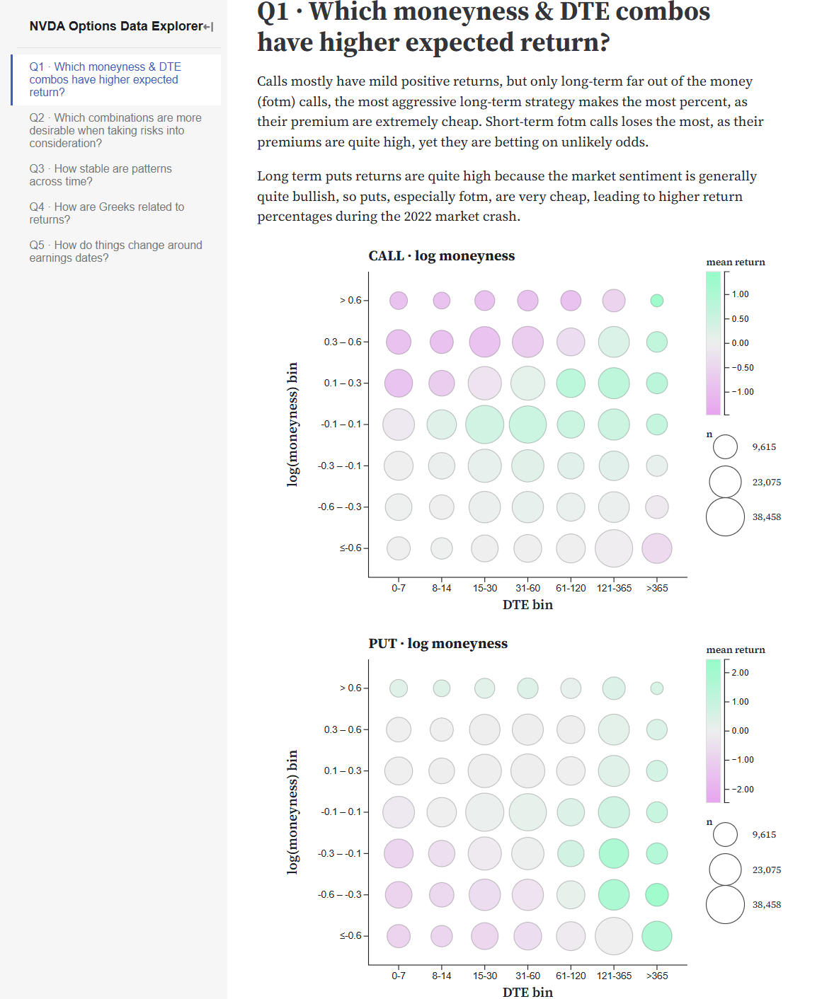
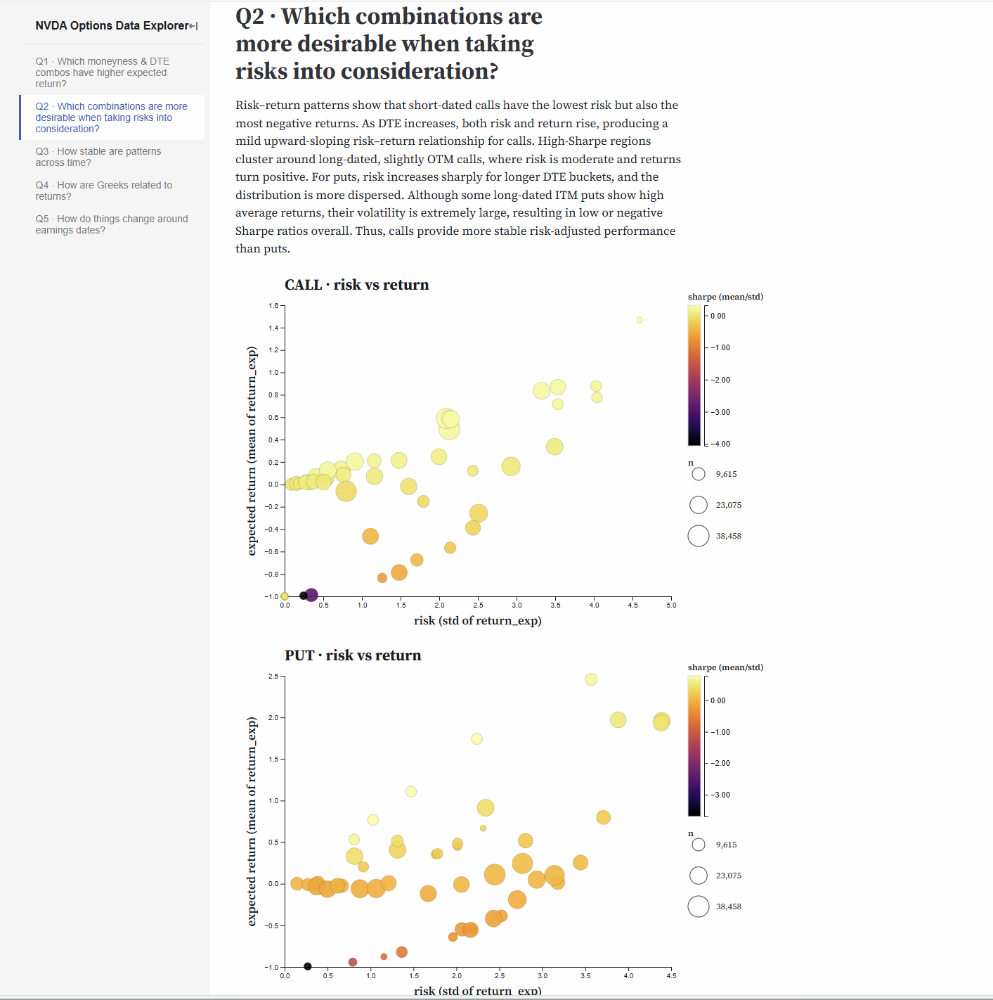
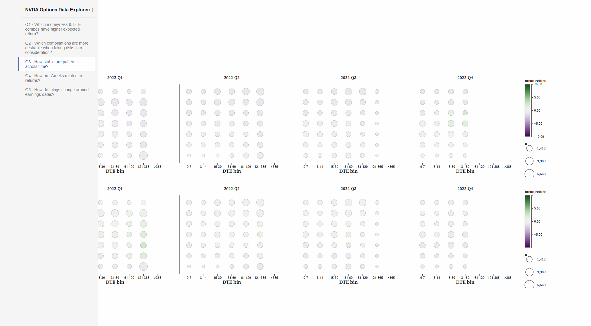
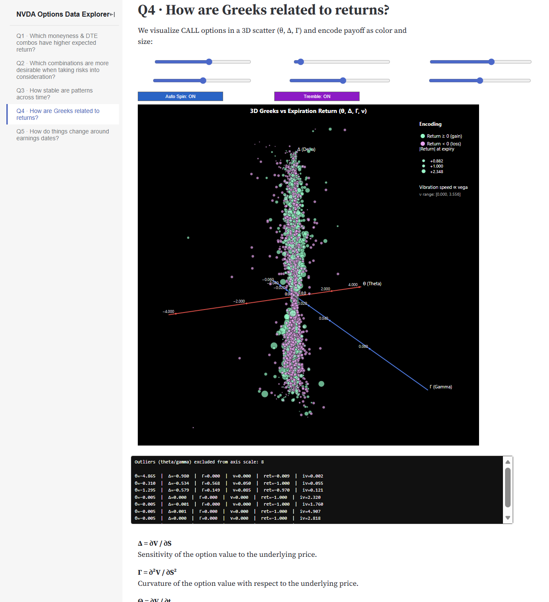
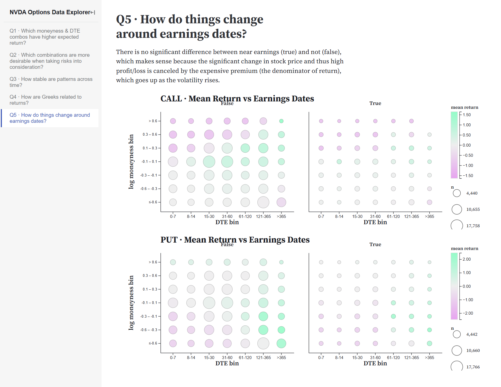

# NVDA Options Data Explorer (Q1–Q5)

This repo explores NVIDIA (NVDA) option chains (2020–2022) and answers five domain questions with **Python preprocessing** + **D3 (Observable)** visuals (We even have a Dark Mode Visual!).

---

## Repository layout

```
src/
  charts/
    bubble.js
    facet.js
    greek.js
    index.js
    legends.js
    orders.js
    risk.js
    theme.js
    utils.js

  data/

  scripts/
    run_all.py                         # run all
    preprocess_data.py                 # master preprocessing (keeps ALL raw columns; adds bins/greeks/derived)
    q1.py                              # make data/q1.csv
    q2.py                              # make data/q2.csv
    q3.py                              # make data/q3.csv
    q4.py                              # make data/q4.csv
    q5.py                              # make data/q5.csv

  index.md
  q1_moneyness_dte.md                # Observable page
  q2_risk_tradeoff.md                # Observable page
  q3_stability_over_time.md          # Observable page
  q4_greeks_vs_returns.md            # Observable page
  q5_earnings_effects.md             # Observable page

  styles.css
```

---

# 📊 Results Overview (Q1–Q5)

Below are the visual outputs from each analysis.

---

## **Q1 · Which moneyness & DTE combos have higher expected return?**

**Insight:**  
- Calls: long-dated (121–365 & >365) and slightly OTM buckets yield the most positive expiration returns.  
- Puts: opposite structure; returns peak for long-dated ITM puts.

**Screenshot:**  


---

## **Q2 · Which combinations are more desirable when taking risk into consideration?**

**Insight:**  
- Calls show a mild upward-sloping risk–return trend with long-dated options offering better Sharpe.  
- Puts have high dispersion and worse risk-adjusted performance.

**Screenshot:**  


---

## **Q3 · How stable are patterns across time?**

**Insight:**  
- Shape of returns is stable: long-dated options dominate across quarters.  
- Magnitude varies with NVDA's macro environment—especially during 2021–2022 volatility.

**Screenshot:**  




---

## **Q4 · How are Greeks related to returns?**

**Insight:**  
- Extreme returns cluster at **low delta / low vega** (cheap OTM options).  
- Greeks describe risk exposure but do not reliably predict mean returns.

**Screenshot:**  


---

## **Q5 · How do things change around earnings dates?**

**Insight:**  
- Earnings weeks compress return outcomes.  
- Both calls and puts show weaker returns near earnings due to elevated IV + volatility crush.

**Screenshot:**  


---

# 🚀 How to Reproduce

```bash
# 1. Preprocess master dataset and Generate Q1–Q5 CSVs
python src/scripts/run_all.py
